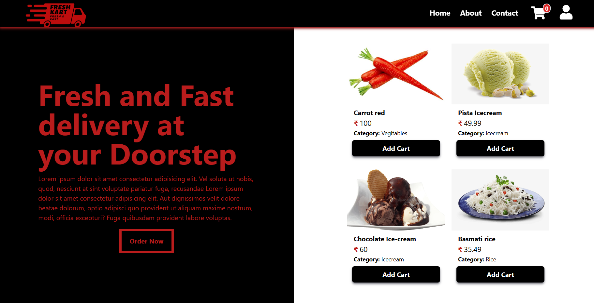
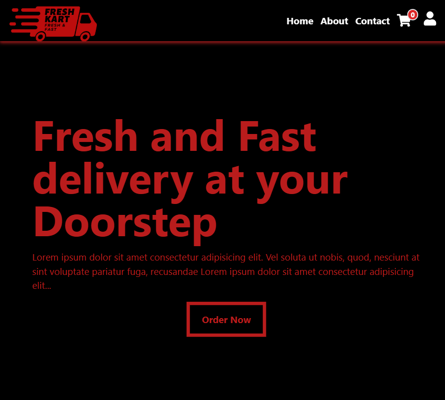
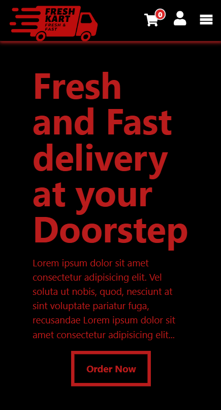

# FreshKart E-commerce MERN-App

This is a complete Fullstack e-commerce Responsive MERN App. The user can create and delete a product, there is an admin login for only product addition and deletion and other things are done by normal users. In this, there is also a payment gateway Stripe through which we can do the payment.

## Table of contents

-   [Overview](#overview)
    -   [The Theme](#the-theme)
    -   [Screenshot](#screenshot)
    -   [Links](#links)
-   [My process](#my-process)
    -   [Built with](#built-with)
    -   [What I learned](#what-i-learned)
    -   [Continued development](#continued-development)
    -   [Useful resources](#useful-resources)
-   [Author](#author)

## Overview

### The Theme

Users should be able to:

-   add products and delete products as admin only.
-   can add products to their cart and also increase or decrease their product count.
-   purchase the product from the cart and also directly from the product details page.
-   purchase the product only when the user is logged in.

### Screenshot

| Home page PC                                                          |
| --------------------------------------------------------------------- |
|  |

| Home page Tablet                                                  | Home Page Mobile                                                     |
| ----------------------------------------------------------------- | -------------------------------------------------------------------- |
|  |  |

### Links

-   [Github Solution](https://github.com/ShivamManiMaurya/FreshKart-Ecommerce-MERN-project-FrontEnd)
-   [Live Site]()

## My process

### Built with

-   HTML5
-   CSS custom properties
-   Flexbox
-   [TailwindCSS](https://tailwindcss.com/) - For styling
-   JavaScript
-   [React](https://reactjs.org/) - JS library
-   [MongoDB](https://cloud.mongodb.com/) - For database
-   NodeJs - For backend
-   ExpressJs - For backend
-   [Redux-Toolkit](https://redux-toolkit.js.org/) - For managing the state

### What I learned

-   Got more familiar with MongoDB and Mongoose
-   Got more familiar with routes, Api
-   Got more familiar with backend technologies like NodeJs and ExpressJs
-   Got more familiar with Redux-toolkit
-   Got more familiar with Async/Await
-   Got more familiar with the Try-Catch block
-   Got more familiar with tailwindCSS
-   Introduction with stripe payment gateway system
-   Learned some good programming practices

### Continued development

After this project, I want to add some more functionalities like improving the authentication system by making it more robust, adding more filtration methods, pagination, searching a product, and many other improvements.

### Useful resources

-   [JavaScript Mastery](https://www.youtube.com/@javascriptmastery) - A very special thanks to JavaScript Mastery.
-   [Akshay Saini](https://www.youtube.com/@akshaymarch7) - Akshay Saini bhaiya helped me in understanding different Javascript concepts.

## Author

-   Website - [Shivam Maurya](https://shivammanimaurya.github.io/my_portfolio_website/)
-   GitHub Page - [Shivam Maurya GitHub](https://github.com/ShivamManiMaurya)
-   Linkedin - [@shivammanimaurya](https://www.linkedin.com/in/shivammanimaurya)
